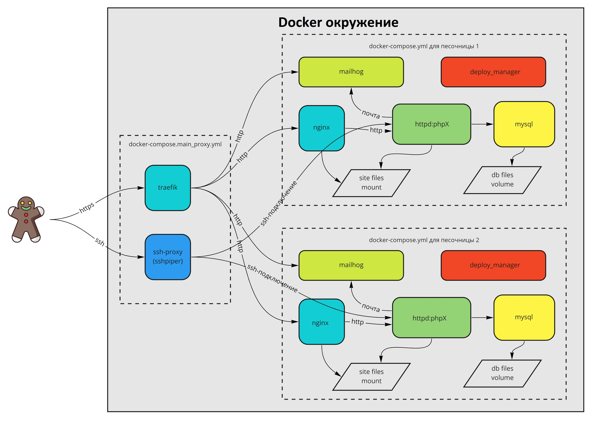

# docker-compose окружение для песочниц

## Структура

Каждая песочница состоит из нескольких контейнеров:

- nginx
- httpd + cron + ssh-сервер
- mysql
- mailhog
- deploy_manager

На сервере (example, <домен>.ru, ...) на входе стоит traefik, который обеспечивает поддержку https через Let’s Encrypt и проксирует запросы в nginx-контейнеры песочниц.

У каждой песочницы свой контейнер с mailhog - фейковым smtp сервером. Web-панель доступна по адресу mail.<песочница>.<домен>.ru

Структура системы показана на схеме:



### HTTP-авторизация

Везде где требуется HTTP-авторизация (в основном для mailhog и <домен>.ru) доступы одинаковые.

- **Логин**: sandbox
- **Пароль**: sandbox

### Подключение по SSH
Внутри каждого контейнера с httpd запущен ssh-сервер. На сервере стоит sshpiper, который проксирует все ssh подключения к 2222 порту прямо в контейнер песочницы.
Для того чтобы попасть в нужную песочницу в качестве логина нужно указать ее домен. Таким образом получается подключение в изолированную среду

Пароль для подключения указывается в переменной окружения SSH_PASSWORD

Например, есть песочница dev2.<домен>.ru. Для подключения по ssh к ней нужно указать следующие данные:

- **Хост**: <домен>.ru
- **Порт**: 2222
- **Логин**: dev2
- **Пароль**: значение из переменной SSH_PASSWORD

Так же при создании песочницы через главную страницу <домен>.ru все доступы приходят письмом на почту.

#### Использование ssh-ключей для подключения

Из-за использования sshpiper добавить свой ssh-ключ на сервер через утилиту ssh-copy-id не получится. Но свой ключ можно добавить на странице с редактированием настроек песочницы (на нее можно попасть из списка песочниц https://example.ru/sites/ нажав на ссылку "Настройки песочницы" рядом с нужной песочницей).

### Подключение к БД
У каждой песочницы свой контейнер с БД. Для подключения нужно использовать следующие доступы:

- **Хост**: mysql
- **БД**: bitrix
- **Логин**: bitrix
- **Пароль**: password

При восстановлении сайта из резервной копии через deploy_manager эти доступы подставятся автоматически в файлы .settings.php и dbconn.php

### Adminer (замена PhpMyAdmin)
На сервере присутствует Adminer, инструмент позволяющий легко администрировать базами данных MySQL.

Web-панель доступна по адресу https://adminer.example.ru

### Crontab

У каждой песочницы свой crontab, запущенный в контейнере с httpd. Для изменения списка задач нужно подключиться по ssh (см предыдущий пункт) и отрекдактировать как обычно с помощью команды
```
crontab -e
```

### Изменение настроек (версия PHP, XDebug, etc)

Для каждой из песочниц есть страница с настройкой ее параметров. Там пока можно изменить версию PHP, включить/выключить XDebug и установить свой ssh-ключ. Попасть на страницу можно из списка песочниц https://example.ru/sites/ нажав на ссылку "Настройки песочницы" рядом с нужной песочницей.

### XDebug

Для удаленной отладки через XDebug нужно следующее:
1. Пробросить себе порт с песочницы с помощью команды `ssh -R <удаленный_порт>:127.0.0.1:<локальный_порт> <песочница>@<домен>.ru -p 2222`, где `<удаленный_порт>` - это порт из настроек XDebug в файле htaccess куда будет стучаться сам XDebug; `<локальный_порт>` - порт, который будет доступен у вас локально; `<песочница>` - часть домена песочницы до .<домен>.ru
2. Задать настройки в файле .htaccess для вашей песочницы:
    1. Если версия PHP < 8.1 (XDebug 2), то настройки такие:
        ```
        php_value xdebug.remote_enable 1
        php_value xdebug.remote_host 127.0.0.1
        php_value xdebug.remote_connect_back 0
        php_value xdebug.extended_info 1
        php_value xdebug.remote_port <удаленный_порт>
        ```
    2. Если версия PHP >= 8.1 (XDebug 3), то настройки такие:
        ```
        php_value xdebug.mode debug
        php_value xdebug.client_host 127.0.0.1
        php_value xdebug.discover_client_host 0
        php_value xdebug.extended_info 1
        php_value xdebug.client_port <удаленный_порт>
        ```
3. В PHPStorm включить прослушивание соединений отладки в меню Run->Start Listening for PHP Debug Connections
4. В браузере в плагине [Xdebug helper](https://chrome.google.com/webstore/detail/xdebug-helper/eadndfjplgieldjbigjakmdgkmoaaaoc) включить режим "Debug".

### Просмотр логов

Для каждой песочницы есть возможность посмотреть логи каждого из ее сервисов. Сделать это можно из списка песочниц, нажав на название нужного сервиса (nginx, httpd, mysql, ...). Есть возможность смотреть логи за 1, 3 и 7 последних дней.

### Срок жизни песочницы

Чтобы не нагружать сервер работой неиспользуемых песочниц работа каждой из них автоматически приостанавливается, если за последние 7 дней на неё ни кто не заходил. 

После того как вы обнаружили, что ваша песочница остановлена, её можно запустить заново вручную со страницы со всеми песочницами.

### deploy_manager
Контейнер deploy_manager служит для подготовки проекта перед стартом.
Чтобы он запускался нужно поставить переменную окружения NEED_EXEC_MANAGER равной 1 в файле .env.

В переменной MODE могут быть указаны следующие варианты:

- **backup_restore** - будет скачан и распакован бэкап сайта. Для этого нужно указать ссылку на него в переменной BACKUP_LINK (идеальный вариант - ссылка для переноса из админки сайта). Если есть файл с БД, то он будет размещен в docker-entrypoint-initdb.d у контейнера с mysql и импортнется при первом старте. **ВАЖНО** если контейнер уже запускался до распаковки бэкапа, то нужно удалить volum'ы с названиями *_mysql_data и *_mysql_db_entrypoint для вашей песочницы. 
- **repo_deploy** - будет склонирован репозиторий, указанный в переменной REPO. Для работы данного функционала в корне проекта нужно будет разместить свой ssh-ключ с названием docker_deploy_manager_id_rsa 
- **install_bx** - установка Битрикса. В переменной BX_REDACTION нужно указать редакцию (start, standard, small_business, business), и в переменной BX_ADMIN_PASSWORD указать пароль к админке. Логин - admin.

## Как запустить

Для простоты управления окружением есть скрипт sandbox. Подробное описание всех команд можно получить выполнив команду ./sandbox -help.

Перед запуском нужно переименовать файл .env.example в .env, и заполнить значения переменных.

## На сервере (example, ...)

Сначала нужно запустить traefik:

```
./sandbox start_main_proxy
```

Для каждой из песочниц в отдельной папке должен быть свой docker-compose.yml файл. Перед стартом нужно заполнить переменные окружения в файле

Для старта песочницы нужно выполнить:

```
./sandbox start
```

## Как запустить локально

Единственное отличие локального запуска - контейнеры используют только свою внутреннюю сеть и nginx открывает наружу 8080 порт вместо 80.

Для запуска нужно выполнить команду:

```
./sandbox start_local
```

Руками в файле .env установить NEED_EXEC_MANAGER=0

И открыть в браузере http://localhost:8080

Mailhog будет доступен по адресу http://localhost:8025

Для возможности использовать несколько песочниц локально и не прописывать каждую из них в файл hosts можно воспользоваться сервисом [local.gd](https://local.gd) (он перенаправляет все поддомены на 127.0.0.1). Для этого в переменную окружения MAIN_DOMAIN нужно прописать <домен>.local.gd и запустить main_proxy. Тогда все песочницы будут создаваться с доменом <site-domain>.<домен>.local.gd
